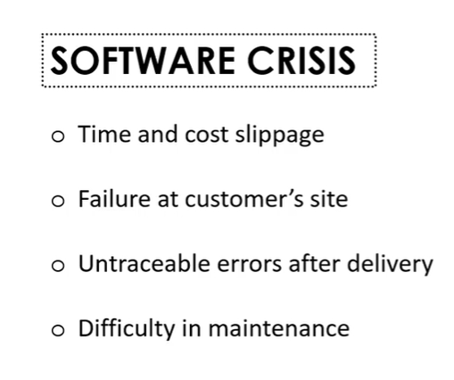

## Software Engineering and Agile software development

- **Software Crisis**
  

- **What is Software Engineering?**
  

---
#### Software Development Phases


---

### Software Engineering Models


- **WaterFall Model**

✅ **Waterfall Model - Explanation:**
**The Waterfall Model is a linear and sequential software development model. It follows a step-by-step process, where each phase must be completed before the next one starts. It looks like a waterfall, flowing down through phases.**

- **📌 Phases of Waterfall Model:**


```
Requirement Gathering:
Understand what the client wants.
Finalize the requirements.
            |
System Design:
Plan the architecture of the system.
Choose hardware/software requirements.
            |
Implementation (Coding):
Developers write code as per design.
            |
Testing:
Test the software to find bugs or errors.
Fix the issues found.
            |
Deployment:
Deliver the software to the customer.
            |
Maintenance:
Update or fix the software after release.
```

📝 Easy Notes on Waterfall Model:
- Oldest and simplest model.
- Follows a linear approach.
- Each phase depends on the previous one.
- No going back once a phase is done.
- Best for small projects with clear requirements.

✅ Advantages:
- Easy to understand and manage.
- Well-documented process.
- Works well for stable and known requirements.

❌ Disadvantages:
- Not suitable for large or complex projects.
- Difficult to handle changes once the process starts.
- Late testing may lead to bugs being found too late.

---
# Prototype Model

The **Prototype Model** is a software development model where a **working model (prototype)** of the system is built **before the final software**. It helps the client understand how the final product will look and work.


---

## 🔄 Steps in Prototype Model:

1. **Requirement Gathering**
   - Understand basic requirements from the client.

2. **Quick Design**
   - Create a simple and rough design of the software.

3. **Build Prototype**
   - Develop a small working version of the software (prototype) based on the quick design.

4. **User Evaluation**
   - Show the prototype to the client.
   - Gather feedback and suggestions.

5. **Refinement**
   - Improve the prototype based on feedback.
   - Repeat the process if needed.

6. **Final Product Development**
   - Once the client is satisfied, develop the final product using the refined requirements.

---

## ✅ Advantages:

- Helps understand user requirements clearly.
- Useful for projects where requirements are not clear at the start.
- Customer feedback improves product quality.
- Reduces chances of major changes later.

---

## ❌ Disadvantages:

- Can be time-consuming if many changes are needed.
- May lead to confusion between prototype and final product.
- Not suitable for every type of project (like large, complex systems).

---

## 📌 Key Points:

- A **prototype is a working demo** of the software.
- Focus is on **user feedback and requirement clarity**.
- Final software is developed after the prototype is approved.

---
# Spiral Model

The **Spiral Model** is a **risk-driven** software development process. It combines the features of the **Waterfall Model** and **Prototyping Model**. The development is done in **loops or spirals**, and each spiral (or phase) includes planning, risk analysis, development, and evaluation.


---

## 🔄 Phases of Spiral Model (in each loop):

1. **Planning**
   - Collect requirements.
   - Define objectives, alternatives, and constraints.

2. **Risk Analysis**
   - Identify and analyze risks.
   - Find solutions to reduce or remove risks.

3. **Engineering (Development & Testing)**
   - Design and develop a prototype or part of the system.
   - Test the output.

4. **Evaluation**
   - Get customer feedback.
   - Decide whether to continue, repeat, or stop the project.

---

## 🔁 How It Works:

- The process is repeated in **spirals (iterations)**.
- Each spiral adds more functionality to the product.
- With each loop, the software becomes more complete.

---

## ✅ Advantages:

- Good for **large and high-risk** projects.
- Risks are identified and handled early.
- Requirements can change during development.
- Customer feedback is included in every phase.

---

## ❌ Disadvantages:

- Can be **costly and time-consuming**.
- Complex to manage.
- Not suitable for small or low-budget projects.

---

## 📌 Key Points:

- Combines design and prototyping in stages.
- Focuses on **risk management**.
- Software is developed in **cycles (spirals)**.
- Customer is involved in every cycle for feedback.

---

# Rapid Application Development (RAD) Model

The **Rapid Application Development (RAD)** model is a **fast and flexible** software development model. It focuses on **quick development** using **prototypes**, **reusable components**, and **user feedback**.


---

## 🔄 Phases of RAD Model:

1. **Requirement Planning**
   - Discuss and finalize broad requirements with the client.
   - Plan the project scope and timeline.

2. **User Design**
   - Design the user interface (UI) and features with client input.
   - Create quick prototypes.
   - Take continuous user feedback and make changes instantly.

3. **Construction**
   - Develop the system using reusable components and tools.
   - Focus on speed and frequent delivery.

4. **Cutover (Deployment)**
   - Final testing, user training, and product launch.

---

## ✅ Advantages:

- Very **fast development** process.
- **Continuous user feedback** improves satisfaction.
- Reusable components save time and effort.
- Reduces overall development cost.

---

## ❌ Disadvantages:

- Not suitable for large or complex systems.
- Needs **high user involvement**.
- Difficult to use with **non-modular systems**.
- Not ideal when performance is a major requirement.

---

## 📌 Key Points:

- RAD is based on **prototyping and iterative delivery**.
- Focuses on **speed, flexibility, and user input**.
- Best for projects with **short deadlines** and **clear modules**.


# 👥 Project Roles and Responsibilities

Below are the key roles involved in a software development project:

---

## 1. **Project Sponsor**
- Provides financial resources and overall support for the project.
- Approves project goals, budgets, and timelines.
- Resolves high-level issues and ensures project alignment with business goals.

---

## 2. **Business Team**
- Understands customer and market needs.
- Defines business requirements and priorities.
- Communicates expectations and feedback to the development team.

---

## 3. **Developers**
- Write and maintain the code for the software.
- Implement features based on requirements and design.
- Fix bugs and optimize performance.

---

## 4. **Testers**
- Ensure the quality of the software.
- Create and execute test cases.
- Identify defects and verify fixes.

---

## 5. **Support Team**
- Provide technical support to users.
- Maintain the system after deployment.
- Handle issues and requests from end users.

---

## 6. **Designer**
- Design the user interface (UI) and user experience (UX).
- Focus on usability, layout, and aesthetics.
- Ensure the software is user-friendly and visually appealing.

---

## 7. **Architect**
- Plans the overall structure of the software system.
- Chooses technologies and design patterns.
- Ensures scalability, performance, and maintainability.

---

## 8. **Project Manager**
- Plans, monitors, and controls the project.
- Coordinates among all teams.
- Ensures project is delivered on time and within budget.

---

Each role is essential to the success of the project, and collaboration among all these roles ensures smooth development and delivery.

---

# 🌟 Agile Software Development

**Agile** is a software development methodology that focuses on **flexibility**, **collaboration**, **customer feedback**, and **rapid delivery**. It breaks the work into **small, manageable units (iterations or sprints)** and encourages constant improvement.

Agile was defined in the **Agile Manifesto (2001)** which contains **4 core values** and **12 principles**.

---

## ✅ Agile Core Values

1. **Individuals and interactions** over processes and tools  
2. **Working software** over comprehensive documentation  
3. **Customer collaboration** over contract negotiation  
4. **Responding to change** over following a plan

---

## 🧭 12 Principles of Agile

1. **Customer satisfaction** through early and continuous delivery of valuable software.

2. **Welcome changing requirements**, even late in development. Agile processes harness change for the customer's advantage.

3. **Deliver working software frequently**, from a couple of weeks to a couple of months, with a preference to the shorter timescale.

4. **Business people and developers must work together** daily throughout the project.

5. **Build projects around motivated individuals.** Give them the environment and support they need, and trust them to get the job done.

6. **The most efficient and effective method of communication** is face-to-face conversation.

7. **Working software is the primary measure of progress.**

8. **Agile processes promote sustainable development.** The team should be able to maintain a constant pace indefinitely.

9. **Continuous attention to technical excellence** and good design enhances agility.

10. **Simplicity—the art of maximizing the amount of work not done—is essential.**

11. **The best architectures, requirements, and designs** emerge from self-organizing teams.

12. **At regular intervals**, the team reflects on how to become more effective, then tunes and adjusts its behavior accordingly.

---

## 📌 Summary

Agile helps teams:
- Deliver faster
- Communicate better
- Respond to change
- Keep customers involved


---

# 🆚 Traditional vs Agile (Easy Comparison)

| Feature              | Traditional Model (Waterfall)        | Agile Model                          |
|----------------------|--------------------------------------|--------------------------------------|
| **Process**          | Step-by-step                         | Small steps again and again (loops)  |
| **Planning**         | Done once at the start               | Done in every phase                  |
| **Customer Role**    | Only at start and end                | Involved all the time                |
| **Changes**          | Hard to make changes                 | Easy to accept changes               |
| **Delivery**         | Final product at the end             | Small working parts delivered often  |
| **Testing**          | Done after coding                    | Done during every step               |
| **Feedback**         | Comes late                           | Comes early and often                |
| **Risk**             | Found late in the project            | Found and solved early               |
| **Documents**        | More documents                       | Less, only needed ones               |
| **Team Work**        | Works in silos (separately)          | Works together every day             |
| **Good For**         | Simple, fixed projects               | Changing, fast projects              |

---

## 📝 Summary

- ✅ Use **Traditional** when everything is clear and won't change.
- ✅ Use **Agile** when things may change and fast feedback is needed.
